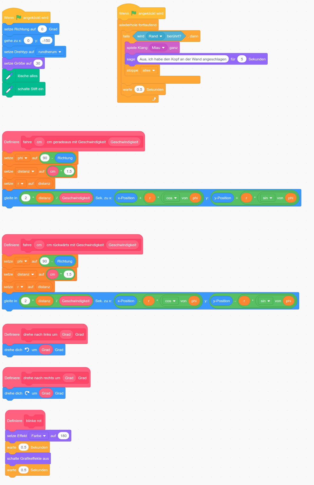

# Einführung
## Was ist Scratch?
Scratch ist eine bildungsorientierte visuelle Programmiersprache, welche
Kindern, Jugendlichen wie auch Erwachsenen den einfachen Einstieg in die
Programmierung ermöglicht. Es eignet sich vorallem um Animationen und
Spiele zu erstellen. Es kann jedoch auch externe Hardware angesprochen
werden, wie die Lego-Roboter Boost, WeDo und Mindstorm. Mehr
Informationen findest du [hier](https://scratch.mit.edu/about) und
speziell für Lehrkräfte [hier](https://scratch.mit.edu/educators) (zum
Teil jedoch nur auf Englisch)

## Welche Lego® Roboter können mit Scratch programmiert werden?
- [Lego® Mindstorms EV3](https://education.lego.com/de-de/product/mindstorms-ev3)
- [Lego® WeDo 2.0](https://education.lego.com/de-de/product/wedo-2)
- [Lego® Boost](https://www.lego.com/de-ch/product/boost-creative-toolbox-17101)

## Vorbedingungen
##### Was brauche ich, um die Übungen selbst zu programmieren?
Um Scratch zu programmieren brauchst du nichts weiteres als einen PC
(Windows, Mac, Linux) oder ein Tablet (Android, iOS) mit einem aktuellen
Browser.

###### Mit Roboter

Um einen Lego-Robotor mit Scratch zu programmieren, benötigst du
Folgendes:
- PC (macOS 10.13+, Windows 10, ChromeOS) **mit Bluetooth** 
- Scratch Link installieren. Folge
  [diesen Anweisungen](https://scratch.mit.edu/boost). Scratch Link
  kommuniziert mit dem Lego-Roboter via Bluetooth. 
  - Linux wird von Scratch Link leider nicht unterstützt.

Falls du deinen eigenen Roboter in den Workshop mitbringen willst,
sollte er folgende Eigenschaften aufweisen:
- Fahren vorwärts
- Fahren rückwärts
- Drehen an Ort

Am besten geht dies mit einem einfachen Roboter mit Raupenantrieb.

TODO Foto hier

###### Ohne Roboter
Du kannst auch ohne eigenen Roboter am Workshop teilnehmen und die
Übungsaufgaben programmieren. Wir werden den Roboter ganz einfach mit
Scratch simulieren. Dazu brauchst du nur einen Laptop mit einem
aktuellen Browser.

# Aufgaben
## Aufgabe 1 (Programmierkärtchen)
Ein Teilnehmer ist der Programmierer und ein anderer Teilnehmer «spielt»
den Roboter. Der Programmierer reiht die Programmierkärtchen so an, dass
der Roboter ein Rechteck abläuft. Der Roboter-Teilnehmer muss die
Befehle auf den Kärtchen genau befolgen. Hinweis: Bei einem Rechteck
beträgt der Winkel (Drehung) in den Ecken 90 Grad (ein sogenannter
Rechter Winkel).

## Aufgabe 2 (Anweisungen in Reihenfolge)
Jetzt gilt es ernst! Schreibe ein Scratch-Programm, so dass der
Lego-Roboter ebenfalls ein Rechteck abfährt. Als Geschwindigkeit wählst
du «50». Das ist eine mittlere Geschwindigkeit. 1 wäre ganz langsam und
100 wäre maximale Geschwindigkeit.

## Aufgabe 3 (Eingabe und Variablen)
Bis jetzt haben wir die Anzahl cm der Seitenlängen fest einprogrammiert.
Wir möchten jedoch ein bisschen flexibler sein und wollen nicht jedesmal
das Programm ändern, wenn der Roboter ein grösseres oder kleineres
Rechteck abfahren soll. Vielmehr soll uns Scratch (die kleine Katze)
fragen, wieviele cm der Roboter für die lange und kurze Seite fahren
soll.

Dazu speichern wir die Seitenlängen in sogenannte «Variablen» ab. Wir
brauchen zwei solcher Variablen und benennen sie «seiteLang» und
«seiteKurz». Du kannst dir diese Variablen wie kleine Zettelchen
vorstellen. Ein Zettelchen beschriftest du mit «seiteLang», das andere
mit «seiteKurz». Darauf schreibst du die Anzahl cm der Seitenlänge.
Genau wie bei unseren Programmierkärtchen! Scratch, die Katze, frägt uns
nach der Seitenlänge und schreibt unsere Antwort auf das Zettelchen. 

## Aufgabe 4 (Berechnungen und Operatoren)
Der Roboter soll ein **gleichschenkliges Dreieck** fahren. Bei einem
gleichschenkligen Dreieck sind immer zwei Winkel gleich gross und zwei
Seiten gleich lang.

Das Programm soll dich nach der **Seitenlänge c und nach dem Winkel α
fragen.** Der Robotor soll bei Punkt B starten und schaut zu Beginn in
Pfeilrichtung. Am Schluss soll er wieder bei Punkt B sein und ebenfalls
in Pfeilrichtung schauen. Damit du diese Aufgabe lösen kannst, musst du
folgende zwei Gleichungen der gleichschenkligen Dreieckstheorie kennen:

1. 2α + γ = 180°

2. })

Überlege dir:
- Welche Seite und welche Winkel kennst du?
- Welche Seiten und welchen Winkel muss das Programm berechnen?
- Wie muss sich der Roboter genau in den Ecken drehen?

## Aufgabe 5 (Eingabeprüfung mit Wenn/Dann/Sonst)
Wenn du jetzt nach der Seitenlänge gefragt wirst, könntest du eine
riesengrosse Zahl eingeben (z. B. 1000 cm = 10 Meter). Aber soviel Platz
haben wir nicht im Schulzimmer! Der Roboter würde in eine Wand fahren.
Unser Programm soll unsere Eingabe überprüfen:
* Die Seitenlänge soll zwischen 10 cm und 300 cm liegen
* Der Winkel α muss zwischen 10 und 80 Grad liegen.

Das heisst:

Wenn die Eingabe kleiner als 10 cm ist oder grösser als 300
cm, resp. kleiner als 10 Grad oder grösser als 80 Grad, dann soll
Scratch eine Fehlermeldung sagen: «Deine Eingabe ist falsch» Der Roboter
soll im Fehlerfall nicht fahren.

Wenn die Eingabe korrekt ist, soll keine Fehlermeldung erscheinen und der Roboter soll fahren.

## Aufgabe 6 (Parameter anpassen)
Der Roboter soll das letzte Teilstück (Seite c) rückwärts
fahren. Das erste Teilstück soll er etwas langsamer fahren und das letze
Teilstück etwas schneller.

## Aufgabe 7 (Schleife / for-loop)
Das LED-Licht des Roboters soll 1 x mal rot blinken

- soll 2 x rot blinken
- soll 3 x rot blinken
- soll 10 x rot blinken

## Aufgabe 8 (Schleife / do-until-loop)
Das LED-Licht des Roboters soll rot blinken bis du die Leertaste
drückst.

# Lösungen
## Lösung Aufgabe 2

[Lösung im Scratch-Editor](https://scratch.mit.edu/projects/383992918/editor) 
 
 [Lösung_A2.sb3](./src/Lösungen(Lego-Boost)/Lösung_A2.sb3)

## Lösung Aufgabe 3

[Lösung im Scratch-Editor](https://scratch.mit.edu/projects/383993166/editor) 

[Lösung_A3.sb3](./src/Lösungen(Lego-Boost)/Lösung_A3.sb3)

## Lösung Aufgabe 4

[Lösung im Scratch-Editor](https://scratch.mit.edu/projects/383993290/editor) 

[Lösung_A4.sb3](./src/Lösungen(Lego-Boost)/Lösung_A4.sb3)

## Lösung Aufgabe 5

[Lösung im Scratch-Editor](https://scratch.mit.edu/projects/383993381/editor)

[Lösung_A5.sb3](./src/Lösungen(Lego-Boost)/Lösung_A5.sb3)

## Lösung Aufgabe 6

[Lösung im Scratch-Editor](https://scratch.mit.edu/projects/383993487/editor)

[Lösung_A6.sb3](./src/Lösungen(Lego-Boost)/Lösung_A6.sb3)

##### Lösung Aufgabe 6 für Simulationsmodus (ohne Roboter)
[Lösung im Scratch-Editor](https://scratch.mit.edu/projects/383993561/editor)

[Lösung_A6_Simulationsmodus.sb3](./src/Lösungen(Lego-Boost)/Lösung_A6_Simulationsmodus.sb3)

## Lösung Aufgabe 7

[Lösung im Scratch-Editor](https://scratch.mit.edu/projects/383993627/editor)

[Lösung_A7.sb3](./src/Lösungen(Lego-Boost)/Lösung_A7.sb3)

## Lösung Aufgabe 8

[Lösung im Scratch-Editor](https://scratch.mit.edu/projects/383993712/editor)

[Lösung_A8.sb3](./src/Lösungen(Lego-Boost)/Lösung_A8.sb3)

# Anhänge

## Anhang Unterprogramme
Alle Programme verwenden die roten Anweisungen, wie z. B.

Dies sind sogenannte Unterprogramme, die wir selbst definieren, damit
die Lösungen einfacher werden. In Tat und Wahrheit verbirgt sich hinter
der einfachen Anweisung «drehe nach links um ( ) Grad» wiederum eine
Reihe von Anweisungen:
- Motor A muss in die einte Richtung drehen
- Motor B muss in die andere Richtung drehen
- Motoren für eine gewisse Anzahl Rotationen drehen lassen.

Unterprogramme haben u. a. folgende Vorteile:
- Die Hauptprogramme (unsere Lösungen der Aufgaben) werden kürzer und
  einfacher
- Wiederholungen von den gleichen Sequenzen (z. B. für «drehe nach links
  um ( ) Grad» lassen sich vermeiden.
- Unterprogramme bilden eine sogenannte Abstraktion
  - Der rote Teil ist die sogenannte «Schnittstelle» des Unterprogramms
  -  Während die Schnittstelle gleich bleibt, kann sich die
     Implementation ändern. Z. B. für
     - Lego® Boost
     - Lego® Mindstorms EV3
     - Lego® WeDo 2.0
     - Simulationsmodus ohne Roboter
     
TODO Kalibrierung erklären

### Anhang Unterprogramme Lego® Boost

### Anhang Unterpogramme Simulation
Auch ohne Roboter kannst du die Aufgaben dieses Workshops lösen. Anstatt
den Roboter bewegen wir die Katze auf dem Bildschirm. Dazu müssen wir
die Unterprogramme anpassen, resp. auf eine andere Art und Weise
implementieren. Wichtig: Beachte, dass der rote Teil der Unterprogramme,
die sogenannten Schnittstellen, gleich bleiben.

Zuerst musst du drei Variablen erstellen:

Die Anweisungen «lösche alles» und «schalte Stift ein» findest du unter
den Erweiterungen «Malstift». Der Malstift zeichnet die Spur der Katze.

Danach können die Unterprogramme wie folgt implementiert werden:

## Anhang Scratch für zu Hause
Wenn du zu Hause weiter Scratch ausprobieren willst, findest du hier
eine kleine Starthilfe. Es gibt unendlich viele Möglichkeiten, was du
mit Scratch programmieren kannst.

Besuche diese Webseite: 
[https://scratch.mit.edu](https://scratch.mit.edu)

Du kannst sofort loslegen mit Programmieren wenn du auf «Beginne mit dem
Erstellen» klickst. Wenn du deine Programme abspeichern möchtest um sie
später wieder zu verwenden, dann musst du unter «Werde Scratcher» ein
Konto erstellen.

Falls du einen Lego-Roboter (Mindstorms EV3, Boost oder WeDo 2.0) hast,
muss du einmalig das Programm «ScratchLink» auf deinem PC installieren.
Mehr dazu erfährst du hier:
[https://scratch.mit.edu/boost](https://scratch.mit.edu/boost)

Dann kannst du auf der Programmierseite links unten eine Erweiterung hinzufügen:

Danach wählst du deinen Roboter aus:

## Anhang interessante Links
TODO
- Lego-Education
- WeDo - Education App